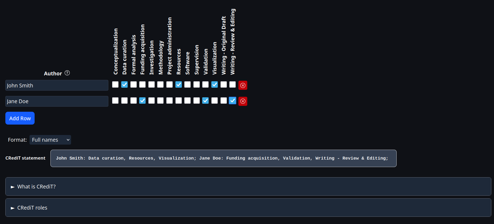

# CRediT Statement Generator

This tool helps generate standardized CRediT authorship contribution statements for academic papers. Using a simple interface, users can select or specify each contributor's roles based on the CRediT (Contributor Roles Taxonomy) system, making the process of assigning authorship contributions accurate, transparent, and consistent.

## Features

-   Supports all CRediT roles
-   Easy role assignment for multiple authors
-   Generates ready-to-use contribution statements
-   Ensures compliance with journal submission guidelines

## Usage

The tool is available at <https://author-contrib.com>

## Contribution

Feel free to submit pull requests or open issues
